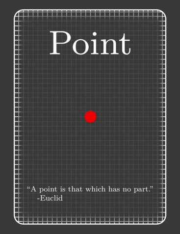
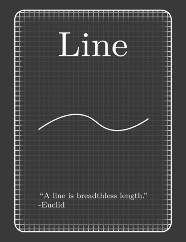
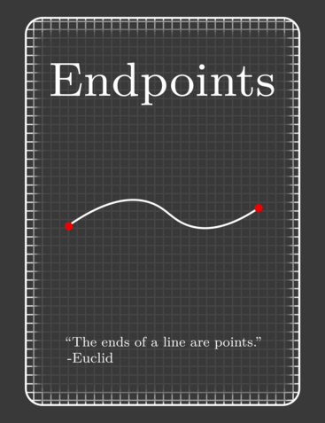

# Euclidia

A 2D platformer about shooting rays to get your cards back.
Made in ~10 hours for Hack Club's Jumpstart YSWS.

**You fall down a deep hole, and on the way, lose 3 cards with important information on them. They look like this.**

